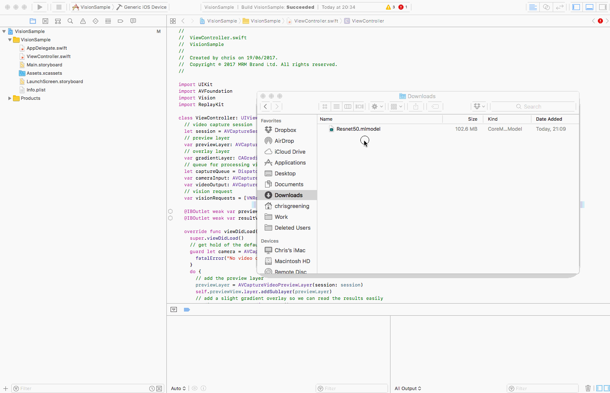

# CoreML-in-ARKit
This simple project detects objects in Augmented Reality and displays 3D labels on top of them. This serves as a basic template for an ARKit project to use CoreML.


[Demo Video - on Youtube](https://www.youtube.com/watch?v=RjIbiAC8cBk)

Model: Inception V3

Language: Swift 4.0

Written in: Xcode 9.0 GM (9A235) (Updated) ~~XCode 9 beta 3 (9M174d)~~

Content Technology: SceneKit

Tested on iPhone 7 plus running iOS 11 beta 3 (15A5318g)

Note: SceneKit can achieve a 60 FPS on iPhone7+ - though when it gets hot, it'll drop to 30 FPS.

## Instructions

You'll have to download "Inceptionv3.mlmodel" from [Apple's Machine Learning page](https://developer.apple.com/machine-learning/), and copy it into your XCode project. (As depicted in the following gif)



[_(Gif via Atomic14)_](https://github.com/atomic14/VisionCoreMLSample)

If you're having issues, double check that the model is part of a target [(source: stackoverflow)](https://stackoverflow.com/questions/45884085/model-is-not-part-of-any-target-add-the-model-to-a-target-to-enable-generation).

## Footnotes

- SceneKit Text Labels are expensive to render. Too many polygons (too much text, smoothness, characters) - can cause crashes. In future, SpriteKit would be more efficient for text-labels.

- Not entirely certain if the code is actually transferring RGB data to the Vision Model (as opposed to YUV). Proof-of-concept-wise, it appears to work just fine with the Inception V3 model for now.

- Whilst ARKit's FPS , is displayed - CoreML's speed is not. However, it does appear sufficiently fast for real-time ARKit applications.

- Placement of the label is simply determined by the raycast screen centre-point to a ARKit feature-point. This could be altered for more stable placement.

## Building Blocks (Overview)

### Get CoreML running in real time in ARKit

- There are some good tutorials / sample projects for getting CoreML running. See: [[ 1 ]](https://github.com/atomic14/VisionCoreMLSample) [[ 2 ]](https://github.com/yulingtianxia/Core-ML-Sample) [[ 3 ]](http://www.stringcode.co.uk/mlcamera/)

- What we do differently here is we're using ARKit's ARFrame as the image to be fed into CoreML.

```
let pixbuff : CVPixelBuffer? = (sceneView.session.currentFrame?.capturedImage)
```

- We also use Threading to continuously run requests to CoreML in realtime, and without disturbing ARKit / SceneView

```
let dispatchQueueML = DispatchQueue(label: "com.hw.dispatchqueueml")
...
loopCoreMLUpdate() // on viewLoad
...
func loopCoreMLUpdate() {
    dispatchQueueML.async {
        // 1. Run Update.
        self.updateCoreML()
        // 2. Loop this function.
        self.loopCoreMLUpdate()
    }
}
```

### Add 3D Text

- Add a Tap Gesture.
- On Tap. Get the raycast centre point, translating it to appropriate coordinates.
- Render 3D text at that location. Use the most likely object.
